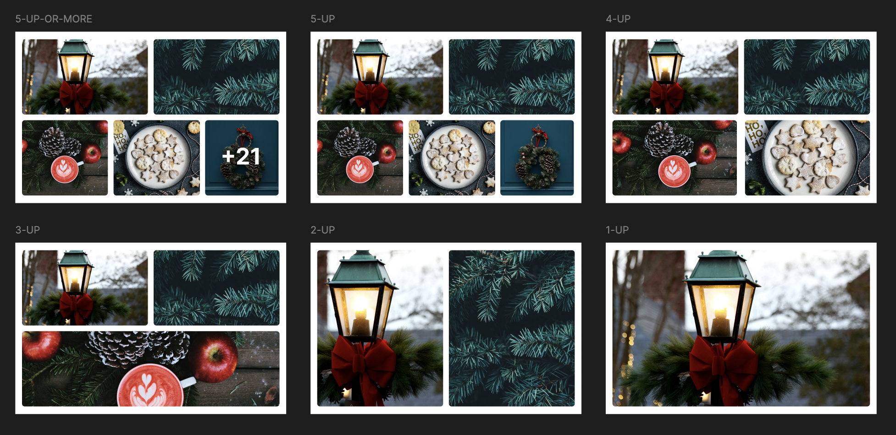

# Photo Gallery Card

Create a photo gallery card, similar to what Facebook uses in their feed. The “trick” here is not just to display the grid, but make the code “smart” enough to display the photos correctly, regardless of whether there’s 1 photo or 21.

